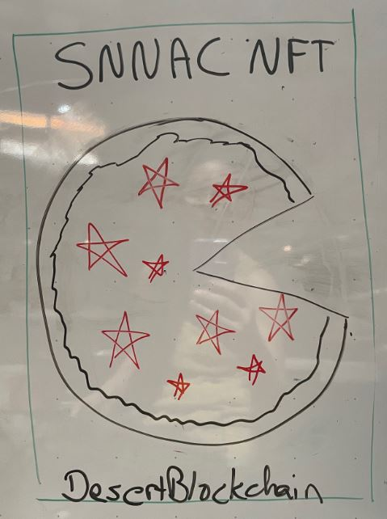
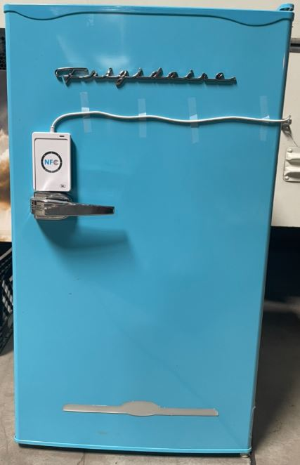

# STELLAR NFT NFC ACCESS CONTROL
<DOCTYPE html>
	<body style="background-color:#8FBC8F;">
	<head>
		<!--	<h1>SNNAC - STELLAR NFT NFC ACCESS CONTROL</h1>-->
	</head>
	<body>The purpose of this project is to create a portable device for granting access confirmed by ownership of an NFT on the Stellar Network.
	

	
Click on the video below which reveals more about the SNNAC Project:

	<body>
		<iframe width="350" height="250" src="https://www.youtube.com/embed/Y_vGJ4IYsvQ" title="Stellar NFT NFC Access Control (SNNAC) Project for SCF#11" frameborder="0" allow="accelerometer; autoplay; clipboard-write; encrypted-media; gyroscope; picture-in-picture" allowfullscreen></iframe>
	</body>
	<article>
	<h2>Project Goals and Objectives:</h2>
		<li><a>Allow Access to Group Activities and Special Events</a>
		<li><a>Create Community Experiences</a>
		<li><a>Encourage Participation and Growth in Emerging Technologies</a>
		<li><a>Provide and Unlock Value to Desert Blockchain Citizen Memberships</a>
		<li><a>Develop a Prototype for Use by Other Groups and Communities</a>	
	

<article>
	<h2>Timeline and Milestones:</h2>
	
9/17/22 & 9/24/22 - Meet to discuss overall project goals and Stellar Community Fund (SCF) #11 Application Submission

	
	
9/25/22 - Submit SCF #11 Application

	

<section>
	
</section>

<aside>
	Previous and Upcoming Activites
</aside>
<footer>
	

	<h2>Contact and Additional Information:</h2>
	
For more information click the following links:

	<ul>
	<li><a href="https://desertblockchain.com/">Desert Blockchain Home Page</a>
	<li><a href="https://www.meetup.com/desert-blockchain/">Desert Blockchain Meetup</a>
	

	<address>
		Contact <a href="mailto:JayCarpenter@DesertBlockchain.com">Desert Blockchain</a>
	</address>
